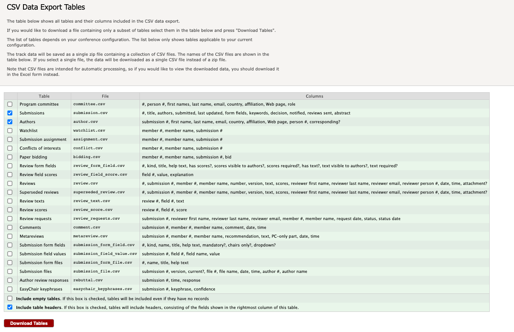

# easychair2acm

Convert EasyChair CSV exports into the **ACM "enhanced CSV"** proceedings-metadata
file that ACM proceedings/publications chairs upload to the ACM eRights /
copyright grid.

Input: the **submission** and **author** tables exported from EasyChair.
Output: one row per author per accepted paper, 31 columns, in ACM's order.

This is a maintained rewrite of
[annaritz/easychair-to-acm-erights](https://github.com/annaritz/easychair-to-acm-erights)
(originally by Di Wu and Anna Ritz):

| original | easychair2acm |
| --- | --- |
| column positions hard-coded | columns located by header name |
| accepted paper ids typed by hand | detected from the `decision` column |
| Proceeding ID edited in the source | `--proceeding-id` option |
| input encoding hard-coded | auto-detected (`--encoding` to override) |
| `assert` tracebacks on any mismatch | plain error messages |
| — | `--list-decisions` to inspect the decision column first |

**Requirements:** Python 3.8+. No third-party packages.

---

## Install

Copy `easychair2acm.py` anywhere on your machine. Optionally:

```bash
chmod +x easychair2acm.py
ln -s "$PWD/easychair2acm.py" ~/.local/bin/easychair2acm
```

Otherwise call it as `python3 easychair2acm.py ...`.

## 1. Export from EasyChair

On EasyChair's **CSV data export** page (under the **Premium** menu):



- tick **Submissions** and **Authors** (untick the rest to keep the download small)
- **"Include table headers"** must be checked (the tool matches columns by name)
- **"Include empty tables"** can be left unchecked
- **Download Tables** → unzip → you get `submission.csv` and `author.csv`

Don't open the CSVs in a spreadsheet and re-save them — that can corrupt accented
author names. The tool reads them fine as-is.

## 2. Check how acceptances are recorded

```bash
python3 easychair2acm.py submission.csv --list-decisions
```

```
distinct values in the 'decision' column:
     58  'accept'
     91  'reject'
```

If the accepted value is exactly `accept`, the default works. Otherwise note the
real text for `--decision-value`.

## 3. Generate the enhanced CSV

Run once per paper type. `--paper-type` is stamped on every row in that run, and
`--proceeding-id` comes from your ACM proceedings setup email.

```bash
python3 easychair2acm.py submission.csv author.csv full.csv \
    --proceeding-id 12345 --paper-type "Full Paper"
```

If the decision text distinguishes the types:

```bash
python3 easychair2acm.py submission.csv author.csv short.csv \
    --proceeding-id 12345 --paper-type "Short Paper" \
    --decision-value "accept as short paper"
```

If the only way to split full vs short is an explicit list:

```bash
python3 easychair2acm.py submission.csv author.csv short.csv \
    --proceeding-id 12345 --paper-type "Short Paper" --id 15,23,88,104
```

Common `--paper-type` values: `Full Paper`, `Short Paper`, `Poster`, `Abstract`,
`Demonstration`, `Workshop Paper`, `Keynote`, `Invited Paper`. Any string is
accepted — match the wording in your ACM instructions.

## 4. Sanity-check

```bash
# distinct papers in the output
cut -d, -f2 full.csv | sort -u | wc -l

# readable preview (keep --header out of the file you send unless ACM asks for it)
python3 easychair2acm.py submission.csv author.csv preview.csv \
    --proceeding-id 12345 --paper-type "Full Paper" --header
column -s, -t preview.csv | less -S
```

The run also prints the accepted count and id list — check them against what you
expect.

## 5. Combine and upload

All output files are headerless, so concatenate the per-type / per-track files
and upload the result to the ACM grid.

---

## Try it

```bash
python3 easychair2acm.py examples/submission.csv examples/author.csv /tmp/out.csv \
    --proceeding-id 12345 --paper-type "Full Paper" --header
```

Produces 5 rows for the 3 accepted papers (`#3` is rejected and dropped), with
`Chloé` / `Ekström` etc. intact.

## Output columns

31 columns in ACM's order. Populated from EasyChair: `proceeding_id`,
`event_tracking_number`, `paper_type`, `title`, `first_name`, `last_name`,
`author_sequence_no`, `contact_author`, `email`, `institution`, `country`.

Left blank because EasyChair doesn't provide them:

- `prefix` / `middle_name` / `suffix`, `orcid`, `acm_profile_id`,
  `acm_client_no` — authors add these in the ACM grid
- `department_school_lab`, `city`, `state_province`, and all `secondary_*` fields
- `section_title`, `section_seq_no`, `published_article_number`, `start_page`,
  `end_page`, `article_seq_no` — not known until the program is scheduled;
  re-upload with these later

## Options

| option | purpose |
| --- | --- |
| `--proceeding-id ID` | ACM Proceeding ID, written to column 1 (required to generate) |
| `--paper-type TYPE` | ACM `paper_type` for every row in this run (required to generate) |
| `--decision-value TEXT` | exact accepted-decision text; repeatable; default matches any `accept*` |
| `--id N` | restrict to these submission numbers; repeatable or comma-separated |
| `--encoding NAME` | force an input encoding instead of auto-detecting |
| `--header` | write a header row |
| `--list-decisions` | print the distinct `decision` values and exit |

## Troubleshooting

| message | cause / fix |
| --- | --- |
| `no column matching (...)` | EasyChair changed a column name — add it to the alias list near the top of `easychair2acm.py`; the failing header is printed |
| `no accepted papers found` | wrong `--decision-value`; run `--list-decisions` |
| `these --id values are not accepted papers` | that submission was rejected/withdrawn, or a typo |
| `no author rows for accepted paper(s): N` | the author export doesn't match the submission export |
| `could not decode ...` | pass `--encoding` (e.g. `--encoding cp1252`) |
| accents wrong **in a spreadsheet** | the spreadsheet's import, not the file — import as UTF-8 |

## `contact_author` values

EasyChair's `corresponding?` (`yes`/`no`) becomes `TRUE`/`FALSE`. If your ACM
sample file uses `Y`/`N` or `1`/`0`, edit `CONTACT_TRUE` and the `"TRUE"` /
`"FALSE"` literals near the top of `easychair2acm.py`.

## Credits

Rewritten from `annaritz/easychair-to-acm-erights` by Di Wu (Texas A&M) and
Anna Ritz (Reed College). ACM enhanced CSV format:
<https://www.acm.org/publications/gi-proceedings-current>.
